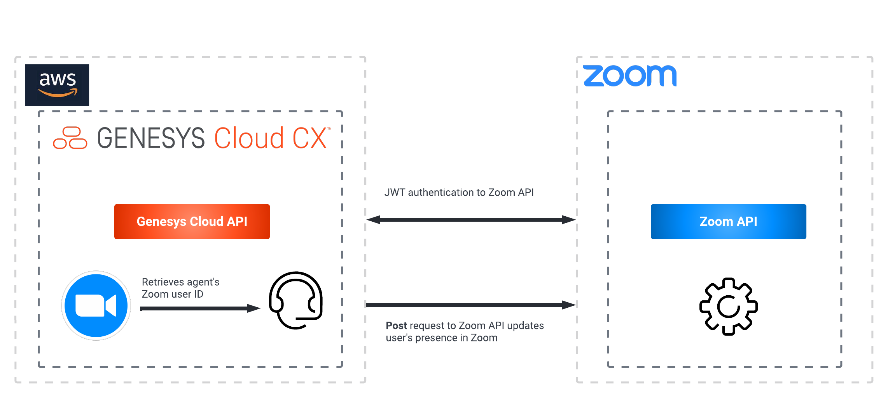

# update-zoom-presence-from-inbound-interaction-trigger-blueprint
This Genesys Cloud Developer Blueprint explains how to set up Genesys Cloud and Zoom for a Genesys Cloud agent's Zoom presence to be updated upon the start and end of an inbound Genesys Cloud voice interaction. When an architect workflow receives an inbound interaction, a Zoom API call will be sent to the Zoom user associated with the Genesys Cloud agent assigned to the interaction.  The Zoom user's presence will be set to "On a Call" when the voice interaction begins.  When the interaction ends, the Zoom user will be returned to "Available".
The following illustration shows the presence solution from an agent’s point of view.

The following shows the end to end agent experience this blueprint enables.

To enable Zoom presence updates to be triggered from Genesys Cloud, you use several public APIs that are available from Genesys Cloud and Zoom. The following illustration shows the API calls between Genesys Cloud and Zoom.

