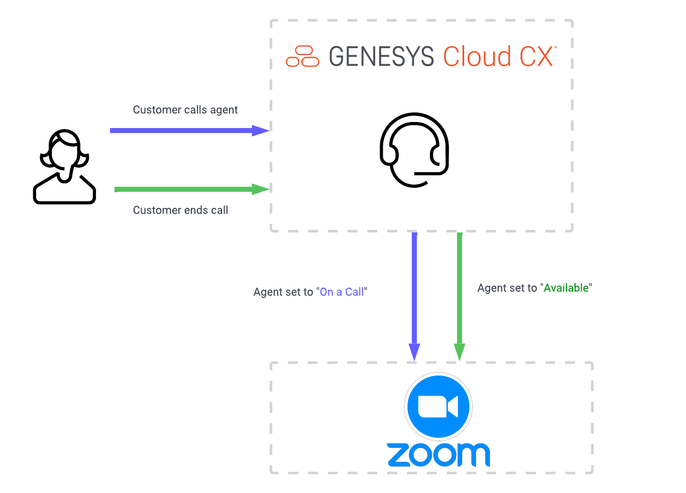
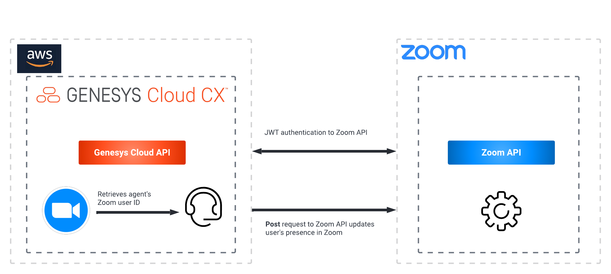
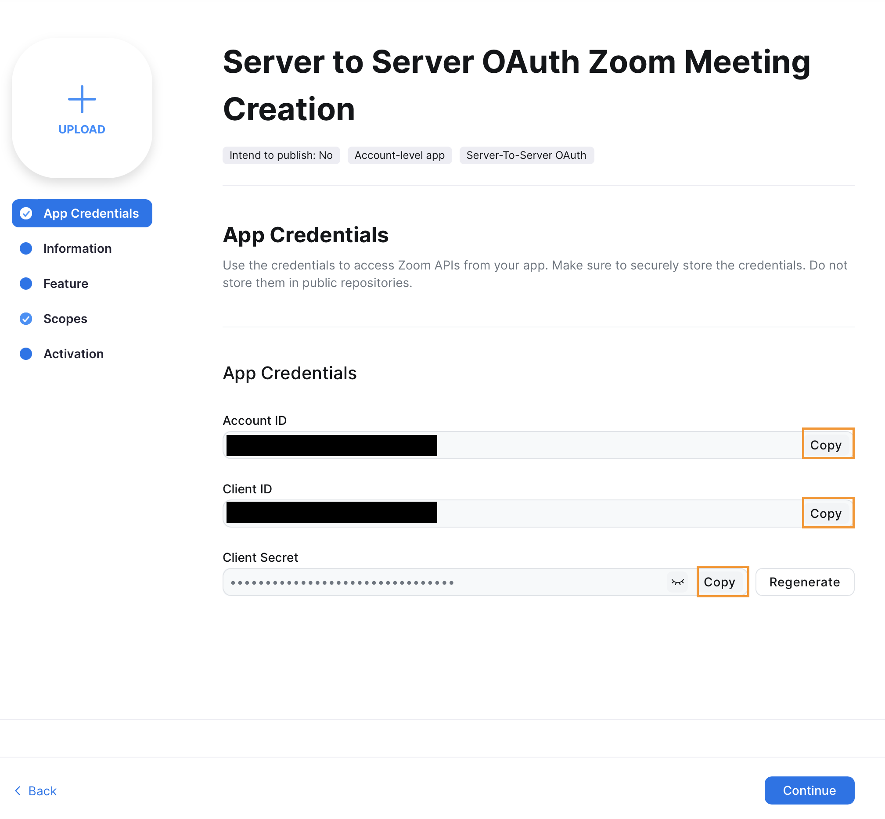
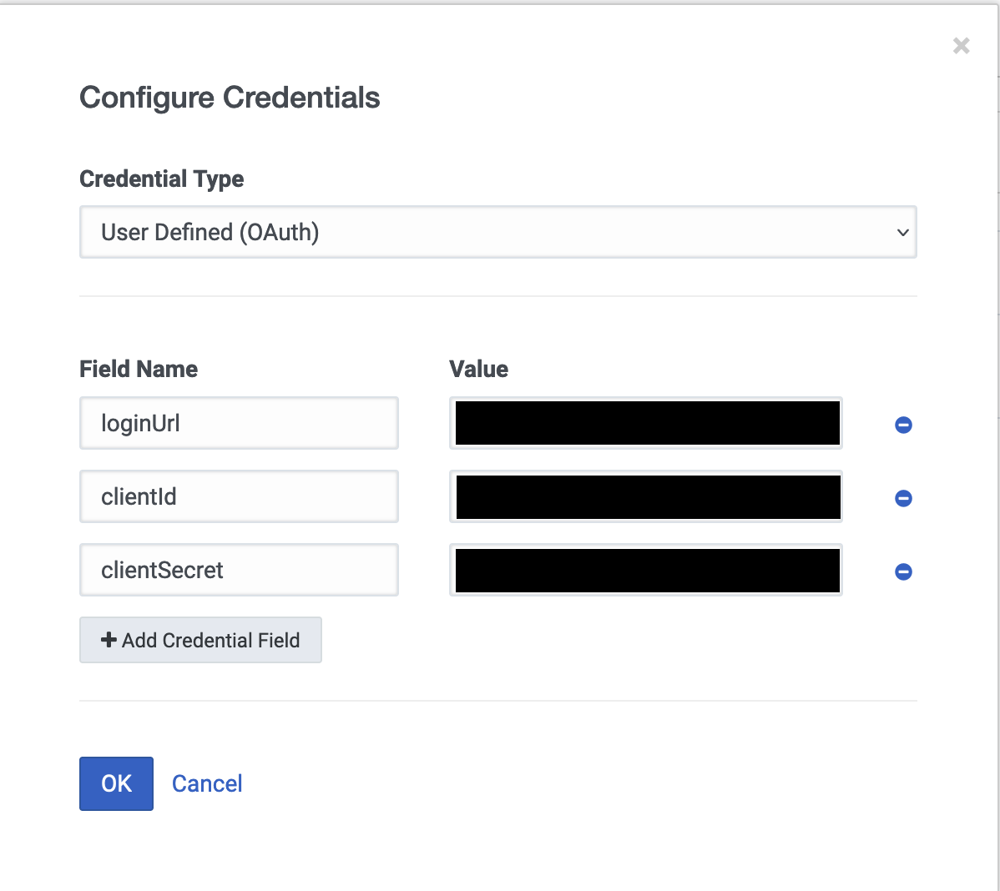

This Genesys Cloud Developer Blueprint explains how to set up Genesys Cloud and Zoom to update a Genesys Cloud agent's presence in Zoom at the start and end of an inbound Genesys Cloud voice interaction.

When an Architect workflow receives an inbound interaction, a Zoom API call is sent to the Zoom user that is associated with the Genesys Cloud agent who is assigned to the interaction. The Zoom user's presence is set to "Do Not Disturb" when the voice interaction begins. When the interaction ends, the Zoom user's presence is set to "Available."

The following illustration shows the presence solution from an agent’s point of view.

The following shows the end-to-end agent experience that this solution enables.

To trigger Zoom presence updates from Genesys Cloud, you use several public APIs that are available from Genesys Cloud and Zoom. The following illustration shows the API calls between Genesys Cloud and Zoom.

## Solution components
* **Genesys Cloud CX** - A suite of Genesys cloud services for enterprise-grade communications, collaboration, and contact center management. Contact center agents use the Genesys Cloud user interface.
* **Genesys Cloud API** - A set of RESTful APIs that enables you to extend and customize your Genesys Cloud environment. The Genesys Cloud API for agentless SMS notifications sends the meeting information to the caller.
* **Zoom** - A virtual meeting and collaboration app. Zoom is the app that hosts the meeting for our solution.
* **Postman** - A platform for creating and sharing APIs.

## Prerequisites

### Specialized knowledge

* Administrator-level knowledge of Genesys Cloud
* Administrator-level knowledge of Zoom
* Experience with REST API authentication
* Experience with Postman

### Genesys Cloud account

* A Genesys Cloud 3 license. For more information, see [Genesys Cloud Pricing](https://www.genesys.com/pricing "Opens the pricing article").
* The Master Admin role in Genesys Cloud. For more information, see [Roles and permissions overview](https://help.mypurecloud.com/?p=24360 "Opens the Roles and permissions overview article") in the Genesys Cloud Resource Center.
* Event orchestration must be activated for your Genesys Cloud organization.

### Zoom

* An Enterprise Zoom account  
* An Admininstrator-level role to set up the required authorization and permissions for Genesys Cloud in Zoom
* A Zoom license for each agent

## Configure the Zoom custom app

To enable Genesys Cloud to authorize and retrieve user information from the Zoom API, register your custom application in Zoom.

1. Log in to the [Zoom App Marketplace](https://marketplace.zoom.us/ "Goes to the Zoom App Marketplace").
2. From the **Develop** menu, click **Build App**.

   

3. In the **JWT** box, click **Create**

   

4. Give your app a name, define the app type, and turn off Zoom App Marketplace publishing. Then click **Create**

5. Expand the **View JWT Token** section. Set **Expire in:** to **Other** and define your desired expiration date.

6. Click **Copy**.

   

## Configure Genesys Cloud

### Add a web services data actions integration

To enable communication from Genesys Cloud to Zoom, add a web services data actions integration:

1. In Genesys Cloud, navigate to **Admin** > **Integrations** and install a **Web Services Data Actions** integration. For more information, see [About the data actions integrations](https://help.mypurecloud.com/?p=209478 "Opens the data actions overview article") in the Genesys Cloud Resource Center.

   

2. Rename the web services data actions integration and provide a short description.

   

3. Click **Configuration** > **Credentials** and then click **Configure**.

   

4. From the **Credential Type** list, select **User Defined**. Then click **Add Credential Field**. In the **Field Name** box, type token. In the **Value** box, paste the JWT token that you obtained when you [configured your Zoom custom app](#configure-the-zoom-custom-app "Goes to the Configure the Zoom custom app section" ). Then click **OK**.

   

5. Activate the integration and click **Save**.

### Create a custom role for use with Genesys Cloud OAuth client

1. Navigate to **Admin** > **Roles/Permissions** and click **Add Role**.

   

2. Type a **Name** for your custom role.

  

3. Search and select the **processautomation**>**trigger**>**All Permissions** permissions and click **Save** to assign the appropriate permissions to your custom role.

:::primary
**Note:** Assign this role to your user record before creating the Genesys Cloud OAuth client, as described in the next section. The **processautomation**>**trigger**>**All Permissions** permissions require event orchestration to be activated in your Genesys Cloud organization.
:::

  

### Create an OAuth client for use with Postman

To create the event orchestration triggers via Postman, you must have a Genesys Cloud OAuth client to authenticate with the Genesys Cloud Public API.

1. In Genesys Cloud, navigate to **Integrations** > **OAuth** and click **Add Client**.

   

2. Enter a name for the OAuth client and select **Client Credentials** as the grant type. Click the **Roles** tab and assign the roles for the OAuth client.

   :::primary
   **Note:** Select a custom role that includes the permission **Messaging** > **Sms** > **Send**. No default role includes this permission. To create a custom role, see the Custom roles information in [Roles and permissions overview](https://help.mypurecloud.com/?p=24360 "Opens the Roles and Permission overview article").
   :::

   

3. Click **Save** and record the client ID and client secret values for later use.

   

### Import the Update Zoom User Presence data action ction

This data action calls the Zoom API to update the Zoom user's presence.

1. from the [update-zoom-presence-from-inbound-interaction repo](https://github.com/GenesysCloudBlueprints/update-zoom-presence-from-inbound-interaction-trigger-blueprint) GitHub repository, download the Update-Zoom-User-Presence.custom.json file.
2. In Genesys Cloud, navigate to **Admin** > **Integrations** > **Actions** and click **Import**.

   

3. Select the Update-Zoom-User-Presence.custom.json file and associate with the web services data action you created in the [Add a web services data actions integration](#add-a-web-services-data-actions-integration "Goes to the Add a web services data actions integration section") section, and then click **Import Action**.

   

### Import the Architect Workflows

This solution includes two Architect workflows that use the data action you just created. These workflows update the user's presence in Zoom:

  * The **GC User Set Zoom User to On a Call_v1-0.i3WorkFlow** workflow is triggered when an agent joins an inbound ACD voice interaction. This workflow sets the user's presence in Zoom to On_a_call.
  * The **GC User Set Zoom User to Available_v1-0.i3WorkFlow*** workflow is triggered when the inbound ACD interaction ends. This workflow sets the user's presence in Zoom to Available.

:::primary
**Note** The user name of the Genesys Cloud agent must match the corresponding Zoom user's email.
:::

These workflows will be called by the event orchestration triggers, which you will create in the next section. When triggered, these Architect workflows will set the Zoom variable, and then update the user's presence in Zoom via the Zoom API.

1. From the [update-zoom-presence-from-inbound-interaction](https://github.com/GenesysCloudBlueprints/update-zoom-presence-from-inbound-interaction-trigger-blueprint") GitHub repository, download the GC User Set Zoom User to On a Call_v1-0.i3WorkFlow file.   

2. In Genesys Cloud, navigate to **Admin** > **Architect** > **Flows:Workflow** and click **Add**.

   

3. Name your workflow and click **Create**.

  

4. From the **Save** menu, click **Import**.

   

5. Select the downloaded **GC User Set Zoom User to On a Call_v1-0.i3WorkFlow** file. Click **Import**.

   

6. Review your workflow. Copy the workflow ID from the URL and save it. You will need it to create teh event orchestration trigger. After you have reviewed your workflow, click **Save** and then click **Publish**.

   

7. From the [update-zoom-presence-from-inbound-interaction](https://github.com/GenesysCloudBlueprints/update-zoom-presence-from-inbound-interaction-trigger-blueprint "Opens the GitHub repo") GitHub repository, download the GC User Set Zoom User to Available_v1-0.i3WorkFlow file.

8.  In Genesys Cloud, navigate to **Admin** > **Architect** > **Flows:Workflow** and click **Add**.

  

9. Name your workflow and click **Create**.

 

10. From the **Save** menu, click **Import**.

  

11. Select the downloaded GC User Set Zoom User to Available_v1-0.i3WorkFlow file. Click **Import**.

  

12. Review your workflow. Copy the workflow ID from the URL and save it. You will need it to create the event orchestration trigger. After you have reviewed your workflow, click **Save** and then click **Publish**.

  

## Create the event orchestration triggers

After you have created the workflows, create the triggers that call them. You need event orchestration activated in your Genesys Cloud organization and you need Postman running on your machine.

1. From the [update-zoom-presence-from-inbound-interaction](https://github.com/GenesysCloudBlueprints/update-zoom-presence-from-inbound-interaction-trigger-blueprint "Opens the GitHub repo") GitHub repository, download the Genesys Cloud Event Orchestration Trigger API's.postman_collection.json file.

2. In Postman, click **Import**.

   

3. Select the Genesys Cloud Event Orchestration Trigger API's.postman_collection.json file and click **Import**.

   

4. In the Genesys Cloud Event Orchestration API's folder, select **Genesys Cloud Client Credential Token Creation**. Change your API domain to match the AWS region in which your Genesys Cloud organization is hosted. The Genesys Cloud organization in this screenshot is hosted in us-east-1.

5. Click the **Authorization** tab. In the **Username** field, paste the client ID from the [OAuth client that you created](#create-an-oauth-client-for-use-with-the-genesys-cloud-data-action-integration "Goes to the Create an OAuth client for use with the Genesys Cloud data action integration section"). In the **Password** field, paste the client secret from the same OAuth client. Click **Send**.

  

5. From the body of the response, copy the **access token**.

   

6. Click **ProcessAutomation Trigger Creation**. On the **Authenication** tab, select **Bearer Token** and paste the access token from the previous step.

   

7. Click the **Body** tab. Be sure to change your API domain to match the AWS region where your Genesys Cloud organization is hosted. Replace **my-workflow-id** with the ID of the **GC User Set Zoom to DoNotDisturb** Architect workflow that you created earlier in this blueprint. Click **Send**.

    

8. To create the second trigger, repeat these steps but change the topicName to `v2.detail.events.conversation.{id}.user.end`. Replace **my-workflow-id** with the ID of the **GC User Set Zoom to Available** Architect workflow that you created earlier in this blueprint. Click **Send**.

    

## Additional resources

* [Update a user's presence status](https://marketplace.zoom.us/docs/api-reference/zoom-api/methods#operation/updatePresenceStatus "Opens the Update a user's presence status page") in the Zoom developer documentation
* [Genesys Cloud notification triggers ("Available topics")](https://developer.genesys.cloud/notificationsalerts/notifications/available-topics "Opens the Available topics page")
* [Prefixes for AWS regions](https://developer.genesys.cloud/platform/api/ "Opens the Overview page in the API section of the Genesys Cloud Developer Center")
* [update-zoom-presence-from-inbound-interaction-trigger-blueprint](https://github.com/GenesysCloudBlueprints/update-zoom-presence-from-inbound-interaction-trigger-blueprint) GitHub repo
